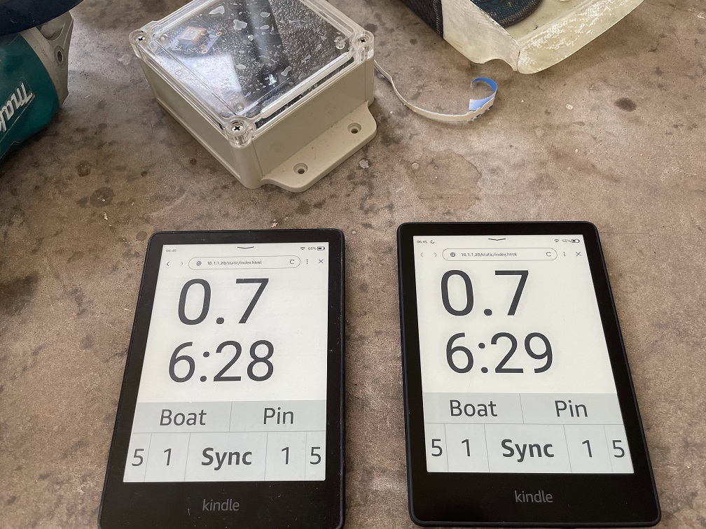

# !! Deprecated !!

I've moved to Rust + SolidJS running on ESP32 and RP2040 MCUs to reduce cost and power. This project was the path finder for my current focus, providing that Kindle Paperwhites are awesome IP67, daylight readable e-ink displays with backlight for night.
I won't be contributing further to this project. 

If you're interested in this project, give me a shout & I'll invite you to beta my latest. Features are:
* Client works on multiple device types, including 2 x Kindle Paperwhites
* Server can run on embedded MCU+GPS, or as a mobile phone app (rust for the win!)
* Support for "apps" e.g. I've built one for race day, for training, for long races (e.g. [Around French Island](https://www.cowesyachtclub.com/afi)) and for night sailing (e.g. [Full moon races!](https://www.google.com/maps/place/34%C2%B012'54.1%22S+140%C2%B026'55.4%22E/@-34.215135,140.4511488,14.31z))
* Data analytics to help me learn to sail faster

# Exteme Racer

ExtremeRacer provides a tactical display for sailing:
1. Runs on Raspbery Pi Zero W with Arduino GPS module
2. Supports multiple Kindle Paperwhite for synchronised displays 

The display provides:
* Start sequence
* Speed over water
* Heading
* Precision start (optional)
* VMG (optional)

In addition, its a data logger to help me track, analyse and understand my sailng performance so as to do it better.

## How it works

The application is built on the [SilkFlow](https://github.com/esensible/silkflow) package to implement a super lightweight, reactive web app... in python. There are many packages to do this, including Plotly Dash, but only SilkFlow specifically supports the archane restrictions of the Silk browser available on the Kindle PaperWhite.

## Pi Setup

1. Install github runner

<!-- 2. sudo visudo 
* ALL=NOPASSWD: /usr/bin/apt-get -->

2. Do the serial setup from the link below
   * https://learn.adafruit.com/adafruit-ultimate-gps-on-the-raspberry-pi/using-uart-instead-of-usb

2. sudo apt update --fix-missing
3. sudo apt install -y uvicorn python3-pip libgeos-dev proj-bin dnsmasq dhcpcd hostapd cron python3-venv    
4. python -m venv /home/pi/venv
4. Deploy application from github
5. Enable extremeracer service to auto-start
   * sudo ln -s /home/pi/extremeracer/extremeracer.service /etc/systemd/system
   * sudo systemctl enable extremeracer
